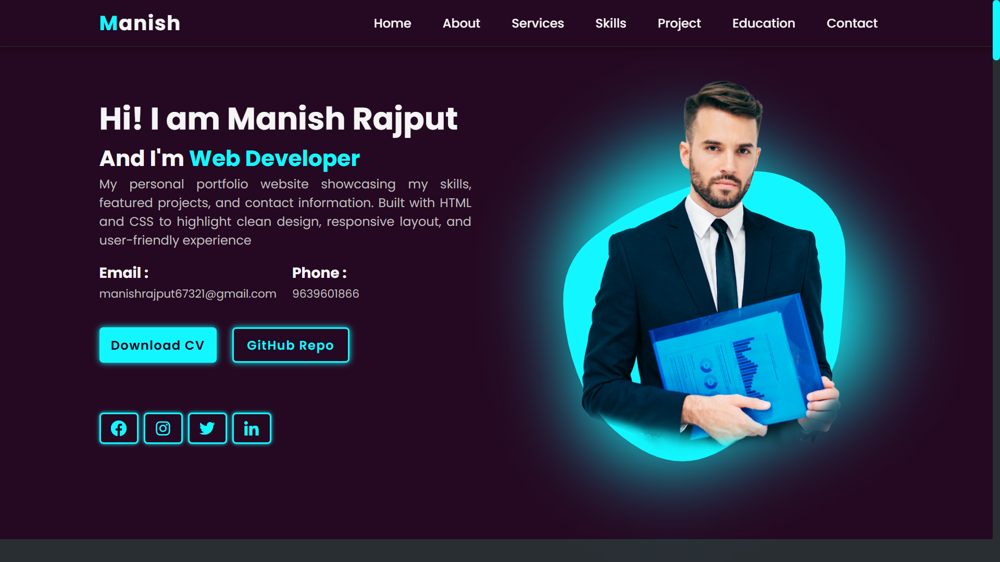

# 🌐 My Portfolio Website

This is my personal portfolio website built using *HTML, **CSS, and basic **JavaScript*.  
It showcases who I am, what I do, and what I have built. This site is fully responsive and cleanly designed.

## 📁 Sections

- *Home* – Landing page with a professional intro
- *About* – Short summary about me and my background
- *Service* – Overview of the services I offer
- *Skills* – List of technical skills and tools I use
- *Projects* – Some of my featured or recent work
- *Education* – My academic background
- *Contact* – How people can get in touch with me

## 🔧 Technologies Used

- HTML5  
- CSS3  
- JavaScript (basic)  
- Responsive Web Design  

## 🌐 Live Demo

[Click here to view the live site](https://manishrajput67321.github.io/my-portfolio)

## 📷 Screenshot

## 📷 Screenshot

## 👤 Author

*Manish Rajput*)

## 👤 Author

*Manish Rajput*
